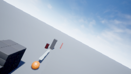
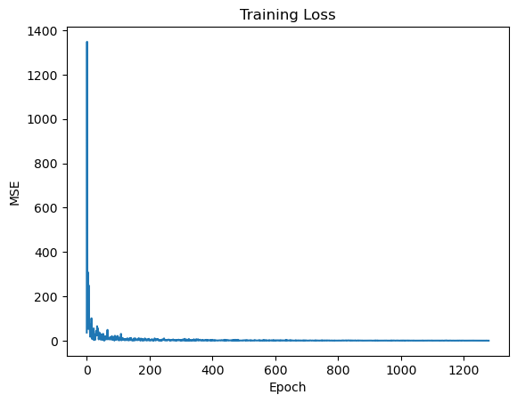
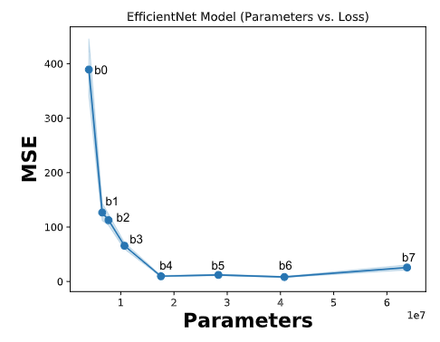
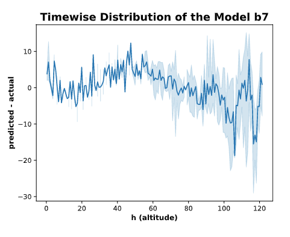
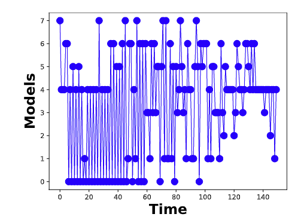
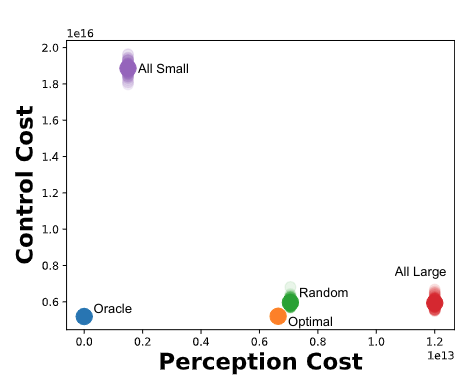

# Dynamic Selection of Perception Models for Robotic Control

Robotic perception models, such as Deep Neural Networks (DNNs), are becoming more computationally intensive and there are several models being trained with accuracy and latency trade-offs. However, modern latency accuracy trade-offs largely report mean accuracy for single-step vision tasks, but there is little work showing which model to invoke for multistep control tasks in robotics. The key challenge in a multi-step decision making is to make use of the right models at right times to accomplish the given task. That is, the accomplishment of the task with a minimum control cost and minimum perception time is a desideratum; this is known as the model selection problem. In this work, we precisely address this problem of invoking the correct sequence of perception models for multi-step control. In other words, we provide a provably optimal solution to the model selection problem by casting it as a multi-objective optimization problem balancing the control cost and perception time. The key insight obtained from this solution is how the variance of the perception models matters (not just the mean accuracy) for multistep decision making, and to show how to use diverse perception models as a primitive for energy-efficient robotics. Further, this demonstrates the approach on a photo-realistic drone landing simulation using visual navigation in AirSim. This proposed policy achieved 38.04% lower control cost with 79.1% less perception time than other competing benchmarks.

## Installation

### Dependencies

- [`Python 3.9.x`](https://www.python.org/)
- [`NumPy`](https://numpy.org/)
- [`SciPy`](https://scipy.org/)
- [`mpmath`](https://mpmath.org/)
- [`pytorch`](https://pytorch.org/)
- [`torchvision`](https://pytorch.org/vision/stable/index.html)
- [`tensorflow`](https://www.tensorflow.org/)
- [`efficientnet_pytorch`](https://github.com/lukemelas/EfficientNet-PyTorch)
- [`cv2`](https://pypi.org/project/opencv-python/)
- [`tqdm`](https://github.com/tqdm/tqdm)
- [`seaborn`](https://seaborn.pydata.org/)
- [`pandas`](https://pandas.pydata.org/)
- Gurobi Python Interface:
  - Please obtain appropriate Gurobi License from [here](http://www.gurobi.com/downloads/licenses/license-center). Please refer to this [link](https://www.gurobi.com/documentation/8.1/quickstart_windows/academic_validation.html) for details. After the license is installed properly, Gurobi can be used from home network.
  - Install Gurobi. Please note that we will need Gurobi Python Interface: 
    - On-line documentation on installation can be found [here](http://www.gurobi.com/documentation/).
    - **[Recommend]** Gurobi Python Interface can also be installed through [Anaconda](https://www.anaconda.com/). Details on installing Gurobi Python Interface through `conda` can be found [here](https://www.gurobi.com/documentation/8.1/quickstart_mac/installing_the_anaconda_py.html#section:Anaconda).

### Downloading the code

1. Download the repository to your desired location `/my/location/`:

2. Once the repository is downloaded, please open `~/.bashrc`, and add the line `export CLD_OFLD_NO_IID_ROOT_DIR=/my/location/Cloud_Offloading_NoIID/`, mentioned in the following steps:

   1. ```shell
      vi ~/.baschrc
      ```

   2. Once `.bashrc` is opened, please add the location, where the tool was downloaded, to a path variable `CLD_OFLD_NO_IID_ROOT_DIR` (This step is crucial to run the tool):

      1. ```shell
         export CLD_OFLD_NO_IID_ROOT_DIR=/my/location/Cloud_Offloading_NoIID/
         ```

### Downloading the trained perception models

1. Please download the models, in a folder `models`, in location `/my/location/Cloud_Offloading_NoIID/`. The dataset is provided in a shared [Google drive](https://drive.google.com/drive/folders/1Akj_ba7Zxh6REa7RqjgoGEXYGhDNQjXM?usp=sharing). 

### Downloading the dataset (Optional)

Note: If you have already downloaded the trained perception model, this step is not required, unless you want to train your own models.

1. The dataset can be downloaded from a shared [Google drive](https://drive.google.com/drive/folders/1cVmCiCxcCsokSwNXnplD7TIyfOJckz4V?usp=sharing).

2. The folder `data` should have the following structure:

   * `airsim_rec.txt`

   * `test`

   * `validation`

   * `train`

3. An example image of the dataset:

   * 

### Verifying the folder structure

After **all** the above steps are performed, the location `/my/location/Cloud_Offloading_NoIID/` should have the following folders:

* `data`
* `lib`
* `models`
* `output`
* `Parameters.py`
* `README.md`
* `src`

## Using The Tool 

Once the dependencies are installed properly, and the path variable is set, the steps provided in the should run without any error.

Following are some of the crucial functionalities offered by this prototype tool:

1. Training `EfficientNet` models for drone landing. 
2. Testing the `EfficientNet` models.
3. Compute Mean and Variance of the models.
4. Perform Model Selection.

### Training `EfficientNet` perception models for drone landing (Optional)

1. Note: These steps are optional. We already provide the trained models.

2. Once the dataset is downloaded and placed in proper location, the models can be trained by simply running the following script, in the location `/src/`:

   * ```shell
     python Train.py
     ```

3. To change parameters, such as `epoch` and `batchsize`, please modify the file `/lib/TrainerEffNetEarlyStop.py`.
4. A sample training plot is given below:
   * 

### Testing the models (Optional)

1. The models can be tested by running the following script in location `/src/`:

   * ```shell
     python Test.py
     ```

2. Following is the accuracy plot:

   * 

### Compute Mean and Variance of the models (Optional)

1. Note: The pickle containing the computed mean and variances are already provided in `/models/`; therefore these steps are again optional. 

2. The mean and the variances of all the models can be computed using the following script in `/src`:

   * ```shell
     python CompMeanVar.py
     ```

3. The above step should create `model_stats_150.pkl` in `/models/`.

4. An example figure of the computed mean and variance of `EfficientNet-b7` is given as:

   * 

### Perform Model Selection

1. The model selection algorithm can be executed simply by running the following script, in `/src/`:

   * ```shell
     python ExpAircraftLanding
     ```

2. All the output plots should be created in `/output/`.

3. Model Selection:

   * 

4. Perception Cost Vs. Control Cost:

   * 

