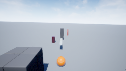
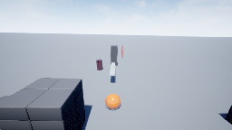
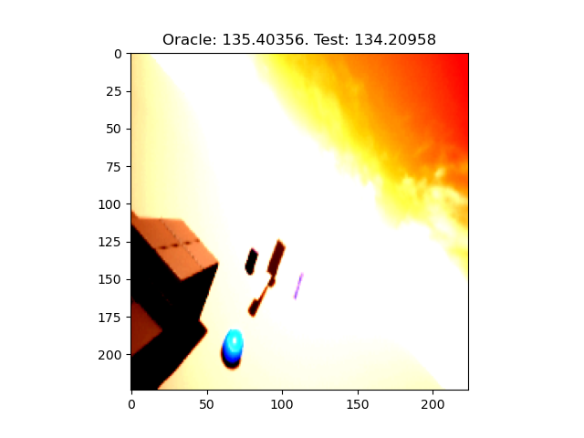
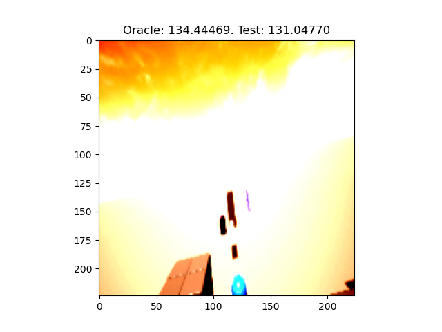

# Report

## Simulated Aircraft Landing

* Plots are shared as pdf.

## AirSim based Aircraft Landing

### Dataset Sample Images





### Training DNN

* What is being predicted?

  * > _The altitude of the helipad. In other words, the input is the image (as shown above), and the output is the (euclidean) distance between the helipad and the drone._


```shell
499/500;	 Loss: 0.23355694115161896;	 Time Taken: 0.9140527248382568.
500/500;	 Loss: 2.2024085521698;	 Time Taken: 0.9012167453765869.
========= Training Completed =========
Time Taken:  490.84684777259827
```

### Testing DNN

```shell
# Model
MAE:  2.0731265544891357
MSE:  10.981839179992676
Total Time Taken:  0.28817319869995117
Average Time Taken:  0.0016189505544941076
Model Parameters:  5406521
```

#### Sample Images

Note: The quality of the images, as of now, are bad as they're directly saved from normalized tensors. I think this can be fixed.

Legend. "Test" means our trained model.



