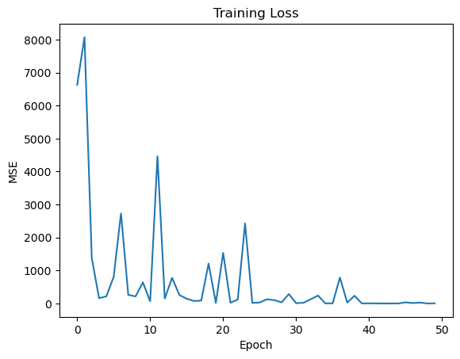
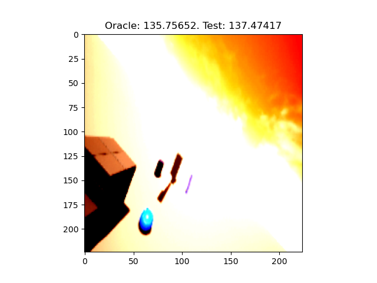
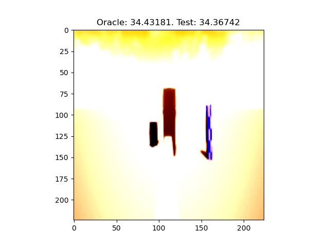

# Report: Eff-Net B0

## AirSim based Aircraft Landing

### Dataset Sample Images

* Same as before.

### Training DNN

* What is being predicted?

  * > _The altitude of the helipad. In other words, the input is the image (as shown above), and the output is the (euclidean) distance between the helipad and the drone._



```shell
49/50;	 Loss: 3.6787705421447754;	 Time Taken: 216.4988248348236.
50/50;	 Loss: 8.829988479614258;	 Time Taken: 218.2907555103302.
========= Training Completed =========
Time Taken:  11275.132796287537
```

### Testing DNN

```shell
MSE:  11.067875862121582
Total Time Taken:  9.928513050079346
Average Time Taken:  0.05577816320269295
Model Parameters:  5288548
```

#### Sample Images

Note: The quality of the images, as of now, are bad as they're directly saved from normalized tensors. I think this can be fixed.

Legend. "Test" means our trained model.



